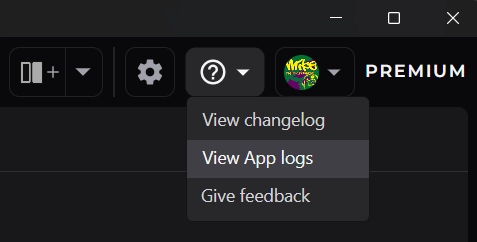

# How to find the log files

To help troubleshoot issues with the app, it's important to be able to find and share you log files. 

## Open the logs folder from the app
To quickly open your logs folder, simply click the "View app logs" button from the help menu located in the top-right of the main window. 

## :fontawesome-brands-windows: Windows
Log files for the app are located in `%LOCALAPPDATA%\NexusMods.App\Logs` on Windows. You can quickly find these files be following the steps below:

1. Press ++win+"R"++ to open the "Run" command box.
2. Paste `%LOCALAPPDATA%\NexusMods.App\Logs` into the Open field and press OK.

3. This will open the correct folder in a File Explorer window.
4. Identify that latest files starting with `nexusmods.app.main.` and ``nexusmods.app.slim.`. You can sort by "Date Modified" to make this easier.
5. Share these files in your Discord, GitHub or Forum post by dragging and dropping them into the text field.

## :fontawesome-brands-linux: Linux
??? tip "Using the terminal"
    If you're familiar with the Linux Terminal, simply type `xdg-open file://$HOME/.local/state/NexusMods.App/Logs/` to browse to the correct location. 

Log files for the app are located in `~/.local/state/NexusMods.App/Logs` on Linux. You can quickly find these files be following the steps below:

1. Open the file explorer and ensure you're at the "Home" directory.
2. Press ++ctrl+"L"++ to edit the file path.
3. In the input box, enter add `/.local/state/NexusMods.App/Logs/` to the end of the existing path. (e.g. `/home/mike/.local/state/NexusMods.App/Logs/`)

4. Identify that latest files starting with `nexusmods.app.main.` and ``nexusmods.app.slim.`. You can sort by "Date Modified" to make this easier.
5. Share these files in your Discord, GitHub or Forum post by dragging and dropping them into the text field.
